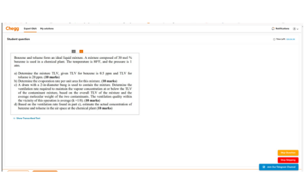

# Chegg Question Skipper

Chegg Question Skipper is a Chrome extension designed to streamline your experience on Chegg's question authoring page. It allows you to skip questions quickly and efficiently with a single click.

## Features

- **Automatic Skipping:** Instantly skip questions on Chegg's question authoring page.
- **User-Friendly Interface:** Simple and intuitive design for seamless user experience.
- **Easy Controls:** "Skip Question" button to move to the next question and "Stop Skipping" button to pause the skipping process.

## Installation

1. Go to the [Chrome Web Store](#) and search for "Chegg Question Skipper".
2. Click on "Add to Chrome" and then "Add Extension" to install.
3. The Chegg Question Skipper icon will appear in your Chrome toolbar.

## How to Use

1. **Navigate:** Go to the question authoring page on Chegg.
2. **Skip:** Click the "Skip Question" button to automatically skip to the next question.
3. **Control:** Use the "Stop Skipping" button if you wish to halt the skipping process.
4. **Settings:** Click the "Open Settings" button to configure extension settings.

## Permissions

The extension requires the following permissions to function properly:

- **activeTab:** Allows the extension to interact with the active tab where the Chegg question authoring page is open.
- **webNavigation:** Enables the extension to monitor navigation events on Chegg's question authoring page to provide the skip functionality.
- **storage:** Used to save user preferences and settings locally on your device.
- **declarativeNetRequest:** Intercepts and modifies network requests to automate the skipping process.
- **Host Permission (https://www.chegg.com/*):** Allows the extension to interact with the Chegg question authoring page.

## Privacy Policy

Your privacy is important to us. The Chegg Question Skipper extension does not collect, store, or share any personal information. All data processed by the extension is handled locally on your browser.

For more details, please read our [Privacy Policy](#).

## Contributing

We welcome contributions! If you have suggestions or improvements, please submit a pull request or open an issue on our [GitHub repository](#).

## Contact

For any questions or support, please contact us at [mustkeem324@gmail.com].

## Join Our Community

Stay updated with the latest news and support by joining our Telegram channel: [Join Now](https://t.me/cheggnx).

## License

This project is licensed under the MIT License - see the [LICENSE](LICENSE) file for details.
